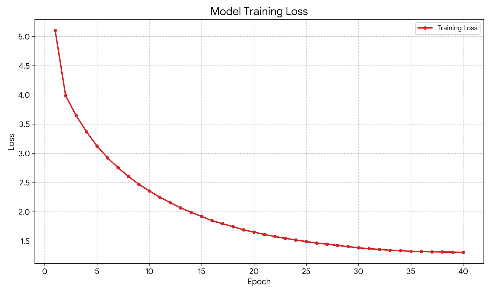

# MaxViT Paper Reproduction(2022)

## Introduction
This project reproduces the MaxViT architecture as described in the original paper.

## Architecture Summary
| Layer (type) | Output Shape | Param # |
| :--- | :--- | :--- |
| **input_layer** (InputLayer) | `(None, 224, 224, 3)` | 0 |
| **conv2d** (Conv2D) | `(None, 112, 112, 64)` | 1,728 |
| **conv2d_1** (Conv2D) | `(None, 56, 56, 64)` | 36,864 |
| **mb_conv** (MBConv) | `(None, 56, 56, 64)` | 74,560 |
| **block_attention** (block_attention) | `(None, 56, 56, 64)` | 50,322 |
| **grid_attention** (grid_attention) | `(None, 56, 56, 64)` | 50,322 |
| **mb_conv_1** (MBConv) | `(None, 56, 56, 64)` | 74,560 |
| **block_attention_1** (block_attention) | `(None, 56, 56, 64)` | 50,322 |
| **grid_attention_1** (grid_attention) | `(None, 56, 56, 64)` | 50,322 |
| **mb_conv_2** (MBConv) | `(None, 28, 28, 128)` | 95,296 |
| **block_attention_2** (block_attention) | `(None, 28, 28, 128)` | 198,948 |
| **grid_attention_2** (grid_attention) | `(None, 28, 28, 128)` | 198,948 |
| **mb_conv_3** (MBConv) | `(None, 28, 28, 128)` | 288,384 |
| **block_attention_3** (block_attention) | `(None, 28, 28, 128)` | 198,948 |
| **grid_attention_3** (grid_attention) | `(None, 28, 28, 128)` | 198,948 |
| **mb_conv_4** (MBConv) | `(None, 14, 14, 256)` | 370,816 |
| **block_attention_4** (block_attention) | `(None, 14, 14, 256)` | 791,112 |
| **grid_attention_4** (grid_attention) | `(None, 14, 14, 256)` | 791,112 |
| **mb_conv_5** (MBConv) | `(None, 14, 14, 256)` | 1,133,824 |
| **block_attention_5** (block_attention) | `(None, 14, 14, 256)` | 791,112 |
| **grid_attention_5** (grid_attention) | `(None, 14, 14, 256)` | 791,112 |
| **mb_conv_6** (MBConv) | `(None, 14, 14, 256)` | 1,133,824 |
| **block_attention_6** (block_attention) | `(None, 14, 14, 256)` | 791,112 |
| **grid_attention_6** (grid_attention) | `(None, 14, 14, 256)` | 791,112 |
| **mb_conv_7** (MBConv) | `(None, 14, 14, 256)` | 1,133,824 |
| **block_attention_7** (block_attention) | `(None, 14, 14, 256)` | 791,112 |
| **grid_attention_7** (grid_attention) | `(None, 14, 14, 256)` | 791,112 |
| **mb_conv_8** (MBConv) | `(None, 14, 14, 256)` | 1,133,824 |
| **block_attention_8** (block_attention) | `(None, 14, 14, 256)` | 791,112 |
| **grid_attention_8** (grid_attention) | `(None, 14, 14, 256)` | 791,112 |
| **mb_conv_9** (MBConv) | `(None, 7, 7, 512)` | 1,462,528 |
| **block_attention_9** (block_attention) | `(None, 7, 7, 512)` | 3,155,088 |
| **grid_attention_9** (grid_attention) | `(None, 7, 7, 512)` | 3,155,088 |
| **mb_conv_10** (MBConv) | `(None, 7, 7, 512)` | 4,495,872 |
| **block_attention_10** (block_attention) | `(None, 7, 7, 512)` | 3,155,088 |
| **grid_attention_10** (grid_attention) | `(None, 7, 7, 512)` | 3,155,088 |
| **global_average_pooling2d_11** (GlobalAveragePooling2D) | `(None, 512)` | 0 |
| **dense_110** (Dense) | `(None, 200)` | 102,600 |

 

**Summary:**
* **Total params:** 33,067,056 (126.14 MB)
* **Trainable params:** 33,025,840 (125.98 MB)
* **Non-trainable params:** 41,216 (161.00 KB)

## Dataset
tiny-imagenet-200 is used as the dataset in this reproduction. The images are augmented with the techniques in the original paper (random resized crop, random horizontal flip, cutmix, mixup, erase, autoaugment and label smoothing).

## Results
We train MaxViT for 40 epochs

| Metric            | Value |
| ----------------- | ----- |
| Training accuracy | 95.13% |
| Test accuracy     | 69.13% |

The training loss for 40 epochs for MaxViT is below

## Discussion
### Overfitting Problem
Compared with CoAtNet we trained earlier, the difference between Training accuracy and test accuracy reduces (26% vs 51.09%). One of the reasons is that self attention in MaxViT can't correlate any two patches in a layer. Although a patch can still correlate another patch in a far distance, grid attention mechanism only allows it to see limited other patches, which reduces the ability to memorise the training data. As a result, it can be found that MaxViT generalise better on limited data. However, the gap between training set and test set (26%) is still huge. To reduce overfitting, larger data set, for example ImageNet-1K should be used.

### Computational efficiency
ViT (12 encoder blocks) we trained earlier has 1.49s/batch, while our MaxViT (11 MaxViT blocks) has 0.50s/batch, which only requires 1/3 training time for a batch. The reason is that self-attention correlates every two patches, which requires lots of computation (O(N ^ 2)), while self-attention in MaxViT computes within a window (O(N)).

### Future work
We can train MaxViT a larger scale of data, for example ImageNet-1K to reduce overfitting.

## References
Tu, Z., Talebi, H., Zhang, H., Yang, F., Milanfar, P., Bovik, A., & Li, Y. (2022). MaxViT: Multi-axis vision transformer. In Computer Vision–ECCV 2022: 17th European Conference, Tel Aviv, Israel, October 23–27, 2022, Proceedings, Part XXIV (pp. 459–479). Springer Nature Switzerland. https://doi.org/10.1007/978-3-031-19815-1_27

Tiny ImageNet Dataset
Wu, J., Zhang, J., Xie, Y., & others. (2017).
Tiny ImageNet Visual Recognition Challenge.
Stanford University.
https://tiny-imagenet.herokuapp.com/
